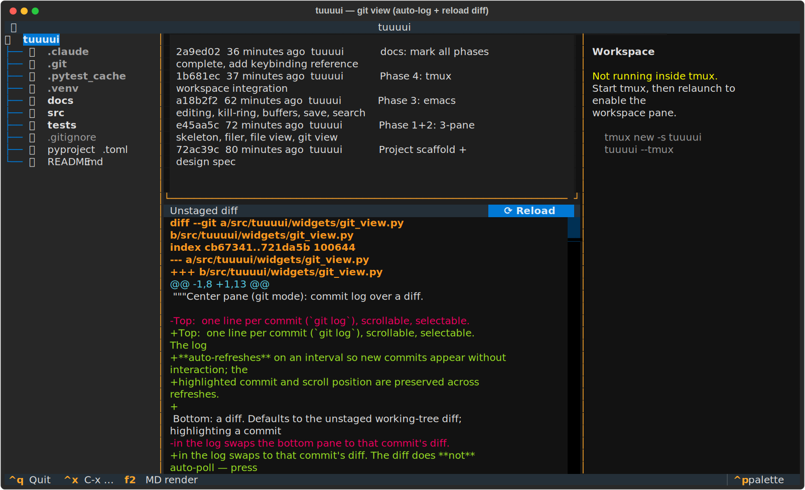
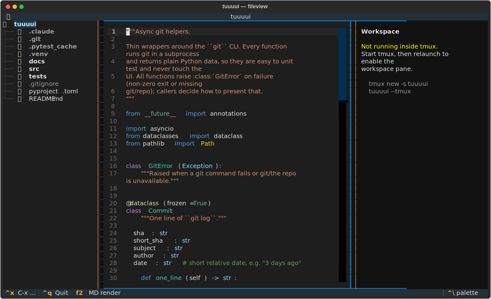
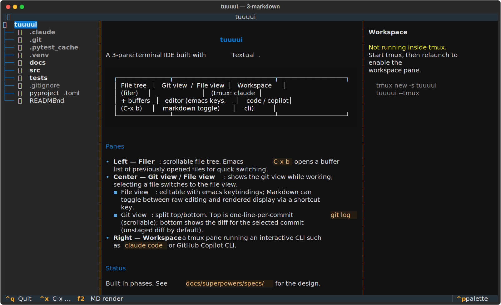
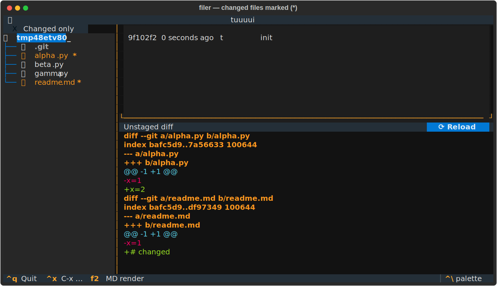

# tuuuui

**tuuuui** は、ターミナル上で動く 3 ペイン構成の軽量 IDE です。左にファイラー、
中央に Git ビュー / エディタ、右に AI CLI 用のワークスペースを並べ、エディタは
Emacs キーバインドで操作します。Python 製 TUI フレームワーク
[Textual](https://textual.textualize.io/) で実装しています。

アプリ本体は **2 ペイン**（ファイラー + センター）に集中し、右側の作業スペースは
アプリ内ウィジェットではなく**実際の tmux 分割ペイン**として隣に起動します。

```
┌──────────────┬───────────────────────────┐ ┆ tmux split pane
│  Filer       │  Git view  /  File view   │ ┆ ┌──────────────┐
│  (file tree) │                           │ ┆ │ claude code /│
│  + buffers   │  emacs editor /           │ ┆ │ copilot cli  │
│  (C-x b)     │  git log + diff           │ ┆ │  (C-x t)     │
└──────────────┴───────────────────────────┘ ┆ └──────────────┘
        tuuuui app (2 panes)                      tmux pane
```

| Git view | File view | Markdown |
|----------|-----------|----------|
|  |  |  |

---

## 概要

開いたソースの編集・Git 履歴の確認・AI CLI への相談を、ターミナルから離れずに
1 画面で行うためのツールです。3 つのペインがそれぞれ独立した役割を持ちます。

- **左 — ファイラー**: スクロール可能なファイルツリー。一度開いたファイルは
  バッファとして記憶され、Emacs の `C-x b` でリスト表示・切り替えできます。
- **中央 — Git ビュー / ファイルビュー**: 作業中は Git ビューを表示し、ファイラーで
  ファイルを選ぶとファイルビューに切り替わります。
- **右 — ワークスペース（tmux）**: `claude code` や GitHub Copilot CLI などの対話的
  CLI を、PTY 埋め込みやアプリ内ペインではなく **tmux の分割ペイン**として隣に起動
  します（最も安定）。アプリ自体は左 2 ペインに専念します。

---

## 特徴

### ファイラー（左）
- ディレクトリツリーをスクロール表示。
- **Emacs ナビゲーション**: 矢印キーに加え `C-n`/`C-p`（上下）、`C-f`/`C-b`
  （次/親）、`C-v`/`M-v`（ページ送り）でツリーを移動。
- **変更ファイルの可視化**: Git ビューで表示中の diff（選択コミット or unstaged）に
  含まれるファイルを、黄色 + `*` マーカーで強調表示。
- **フィルタ**: 上部の「Changed only」チェックボックスを ON にすると、ツリーを
  diff 対象ファイルだけに絞り込み（該当ファイルを含むディレクトリのみ表示）。
- **バッファ機能**: 開いたファイルを最近使った順（MRU）で保持し、`C-x b` で
  ポップアップから切り替え。直前のバッファが既定で選択されます（Emacs 同様）。



### ファイルビュー（中央）
- **シンタックスハイライト**: tree-sitter ベースで Python / Markdown / JSON / TOML /
  YAML / JS / TS / Go / Rust など主要言語の予約語・文字列・コメントを色分け。
- **Emacs キーバインドで編集**: カーソル移動・削除・**kill-ring**（kill/yank）・
  **mark/region**・undo・前方検索・保存（`C-x C-s`）に対応。
- **Markdown 表示トグル**: Markdown ファイルは `F2` で「生テキスト編集」と
  「レンダリング表示」を切り替え。

### Git ビュー（中央）
- 上下 2 ペイン構成。
- **上**: 選択可能なリスト。先頭に作業ツリーの **● Unstaged changes** / **● Staged
  changes** の 2 行があり、続けて `git log` を 1 コミット 1 行で表示（スクロール可）。
  コミット部分は**一定間隔で自動更新**され、新しいコミットが自動反映されます
  （選択行とスクロール位置は維持）。
- **下**: 選択行に応じた diff —— Unstaged 差分 / Staged 差分（`git diff --cached`）/
  選択コミットの差分。diff は自動更新せず、**⟳ ボタン**または **`C-r`** で明示的に
  リロード（編集中の差分確認に便利）。追加=緑 / 削除=赤 / hunk=シアンで色分け。
- 選択行で表示される diff の対象ファイルは、そのままファイラーのマーカー表示・
  「Changed only」フィルタにも反映されます（Unstaged / Staged / コミットすべて対応）。

### ワークスペース（右）
- tmux 内なら `C-x t`（または起動時 `--tmux`）で右側に CLI 用ペインを分割起動。
- 実行コマンドは `--workspace CMD` または環境変数 `TUUUUI_WORKSPACE_CMD` で指定
  （既定は `claude`）。
- tmux の有無・起動状態をペインに表示。

---

## 技術スタック

| 項目 | 採用 | 理由 |
|------|------|------|
| 言語 | Python (>=3.10) | — |
| TUI | **Textual 8.x** | `Tree` / `TextArea` / `OptionList` 等の高水準ウィジェット、CSS 風スタイリング、非同期（git をサブプロセスで await）が揃い、最短で動くものに到達できる。`TextArea` が tree-sitter ハイライトを内蔵。 |
| エディタ基盤 | `textual.widgets.TextArea` を継承 | Emacs キー（`C-x` プレフィックス／kill-ring 等）を `Binding` と独自処理で追加。 |
| ワークスペース | **tmux** に委譲 | 対話的 CLI を PTY 埋め込みするより、tmux 分割ペインの方が安定。 |
| Git 連携 | `git` CLI をサブプロセス実行 | UI 非依存の純関数（`core/git.py`）として実装しテスト容易。 |
| テスト | `pytest` + Textual `App.run_test()` パイロット | core は単体テスト、ウィジェットはキー操作シミュレーションで検証。 |

> 比較検討: `prompt_toolkit`（Emacs 編集はネイティブに強力だが UI を低レベルから自作する
> 必要があり総工数大）、`urwid`/`blessed`（軽量だがモダンな非同期・ウィジェットが弱い）。
> 本アプリは UI 要素（ツリー・diff・ログ・Markdown 表示）の比重が大きいため Textual を採用。

### 構成

```
src/tuuuui/
  __main__.py          エントリポイント（tuuuui コマンド）
  app.py               TuuuuiApp: 3 ペイン配置・C-x プレフィックス・モード切替
  app.tcss             レイアウト用スタイル
  core/
    git.py             非同期 git ヘルパー（log / diff / show）
    buffers.py         BufferManager: MRU バッファ管理
    tmux.py            tmux 分割ペインの起動
  widgets/
    filer.py           左: ファイルツリー（emacs ナビゲーション）
    center.py          中: GitView ⇄ FileView 切替
    file_view.py       中: エディタ + Markdown レンダリング
    git_view.py        中: コミットログ + diff
    emacs.py           Emacs キーバインド層（EmacsTextArea）
    search.py          C-s 検索モーダル
    buffer_list.py     C-x b バッファ切替モーダル
docs/superpowers/specs/ 設計ドキュメント
tests/                  テスト一式
```

---

## インストール

```bash
git clone git@github.com:forzaster/tuuuui.git
cd tuuuui
python3 -m venv .venv
.venv/bin/pip install -e ".[syntax]"      # シンタックスハイライト同梱
```

## 使い方

```bash
# カレントディレクトリを開く
.venv/bin/tuuuui

# 指定ディレクトリを開く
.venv/bin/tuuuui ~/path/to/project

# tmux 内で、右に claude code ペインを自動分割して起動
.venv/bin/tuuuui --tmux

# ワークスペースで起動する CLI を変更
.venv/bin/tuuuui --tmux --workspace "copilot"
```

基本フロー: 左のツリーでファイルを選ぶと中央がファイルビューに切り替わり、Emacs キーで
編集 → `C-x C-s` で保存。`C-x g` で Git ビューに戻り、コミットを選ぶと diff を確認、
`C-r` で最新化。`C-x b` で過去に開いたファイルへジャンプ。`C-x t` で右に AI CLI を起動。

### キーバインド

| キー | 動作 |
|------|------|
| `C-x b` | バッファ切替（最近開いたファイル一覧） |
| `C-x g` | Git ビューを表示 |
| `C-x o` | ペイン間でフォーカス移動 |
| `C-x t` | tmux ワークスペースペインを起動 |
| `C-x C-s` | ファイルを保存 |
| `C-x C-c` | ファイルを閉じて Git ビューに戻る |
| `C-q` | アプリ終了 |
| `F2` | Markdown 生テキスト ⇄ レンダリング表示 |
| `C-r` | Git diff をリロード（Git ビュー内） |
| `C-a` / `C-e` | 行頭 / 行末へ |
| `C-f` / `C-b` / `C-n` / `C-p` | 文字・行単位のカーソル移動 |
| `M-f` / `M-b` / `M-d` | 単語移動 / 単語 kill |
| `C-d` / `C-h` | 前 / 後ろ 1 文字削除 |
| `C-k` / `C-y` | 行を kill / yank（貼り付け） |
| `C-space` / `C-w` / `M-w` | mark 設定 / region を kill / region をコピー |
| `C-s` | 前方検索 |
| `C-/` / `C-_` / `C-z` | undo |

> `C-x` はプレフィックスキーです。`C-x` を押すと下部にヒントが出て、続けて 2 打鍵目を
> 入力するとコマンドが実行されます。エディタ編集中でも 2 打鍵目を確実に横取りするため、
> プレフィックス保留中はエディタへの文字入力より優先されます。

---

## 開発

```bash
.venv/bin/pip install -e ".[dev,syntax]"

# テスト
.venv/bin/python -m pytest -q

# Textual 開発コンソール（別ターミナルで textual console）
.venv/bin/textual run --dev src/tuuuui/app.py
```

設計の詳細は [`docs/superpowers/specs/2026-06-14-tuuuui-design.md`](docs/superpowers/specs/2026-06-14-tuuuui-design.md) を参照してください。

## ステータス

全 4 フェーズ実装済み（テスト 32 件パス）。

| Phase | 内容 | 状態 |
|-------|------|------|
| 1 | 3 ペイン骨組み + ファイラー + ファイルビュー（構文ハイライト） | ✅ |
| 2 | Git ビュー（1 行ログ + 色付き diff、コミット選択、ログ自動更新 / diff 手動リロード） | ✅ |
| 3 | Emacs 編集（`C-x` プレフィックス）+ バッファ（`C-x b`）+ Markdown トグル | ✅ |
| 4 | tmux ワークスペース連携 | ✅ |
